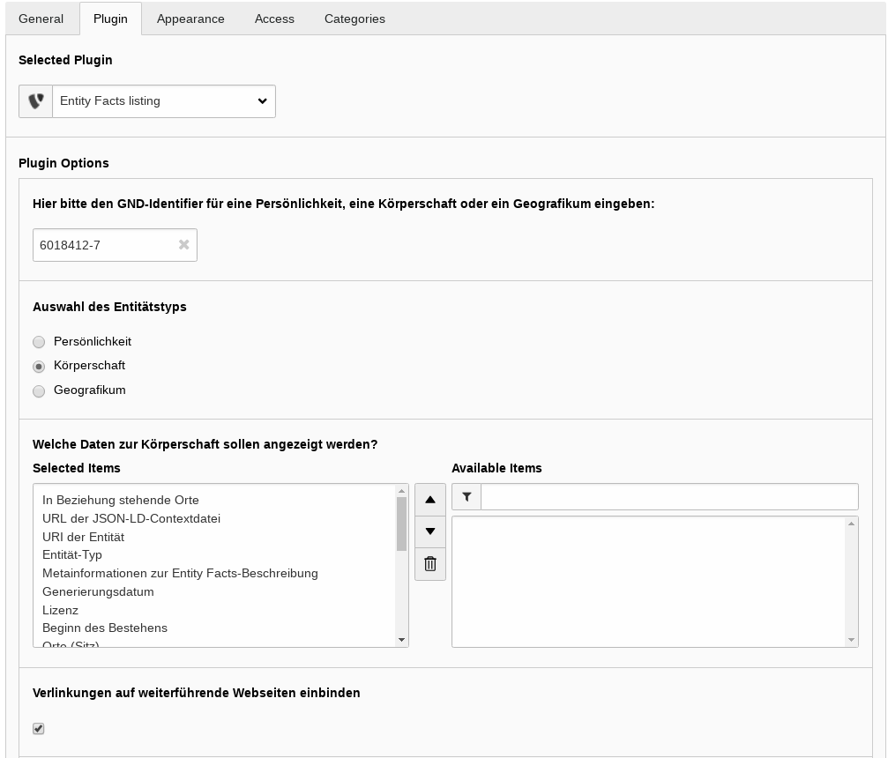

.. ==================================================
.. FOR YOUR INFORMATION
.. --------------------------------------------------
.. -*- coding: utf-8 -*- with BOM.

.. include:: ../Includes.txt

.. _introduction:

Introduction
============

.. _what-it-does:

What does it do?
----------------

The following document holds information about the installation of the TYPO3
SLUB_EntityFacts extension. In case of further questions please contact the
release management.

This TYPO3 extension is primarily meant to show additional facts of historical
personalities or places recorded in the `GND (Integrated Authority File, German: Gemeinsame Normdatei) <http://wikipedia.org/wiki/Integrated_Authority_File>`_.

Those facts are taken from the `Entity Facts webservice <http://www.dnb.de/entityfacts>`_
of the German Nation Library (DNB - Deutsche Nationalbibliothek). There is no
registration necessary. You just need some GND identifier.

.. _screenshots:

Screenshots
-----------

   View of the backend settings
